# Xamarin 시작하기

이 프로젝트의 코드와 문서는 Xamarin을 경험하지 못한 프로그래머나 Xamarin 초보자를 대상으로한 실습 강의에 도움을 주기 위해 작성되었습니다. 강의를 보조하는 목적이므로 내용 설명이 자세하지는 않습니다.

# 문제 해결

## 패키지 재설치

Xamarin과 관련된 nuget 패키지를 설치하는 과정에 설치가 정상적으로 완료되지 않아 응용프로그램 빌드가 실패하는 경우가 있습니다. 이럴 때에는 nuget 패키지를 재설치하면 문제가 해결됩니다. Visual Studio를 종료하고 솔루션 파일(*.sln)이 있는 위치의 'packages' 폴더를 삭제한 후 다시 Visual Studio를 열어 솔루션을 빌드하면 성공합니다. 이 문제는 패키지를 업데이트하거나 페키지 설치히 네트워크 상태가 원활하지 않은 때 자주 발생합니다.

# 네이티브 크로스 플랫폼

네이티브 플랫폼(iOS, Android) API를 사용해 UI를 작성하고 하나의 코드로 작성된 비즈니스 논리를 공유합니다.

## 프로젝트 생성

[File] -> [New] -> [Project] 메뉴를 선택합니다. 새 프로젝트 대화상자에서 [Visual C#] -> [Cross-Platform] 탭을 선택하고 [Blank App (Native Portable)] 항목을 선택해 프로젝트를 생성합니다.

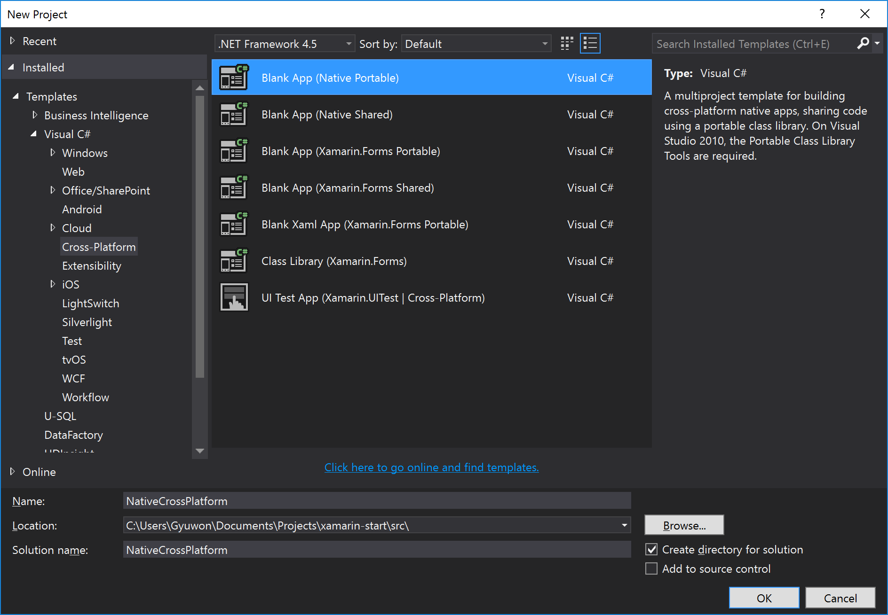

프로젝트가 생성되면 솔루션에 다음과 같은 프로젝트 목록이 보입니다.

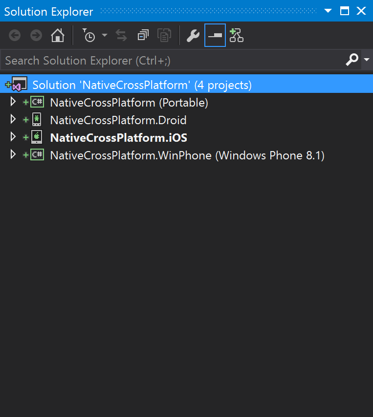

## TapCounterService

초기화된 Android 응용프로그램과 iOS 응용프로그램은 동일한 기능을 가지고 있습니다. 페이지는 버튼을 가지고 있고 이 버튼을 누르면 누른 횟수가 버튼 레이블에 표시됩니다.

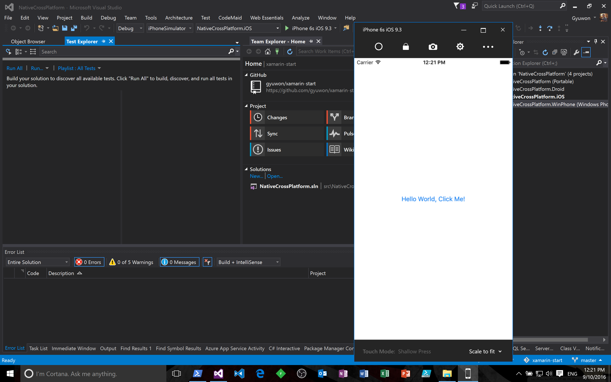

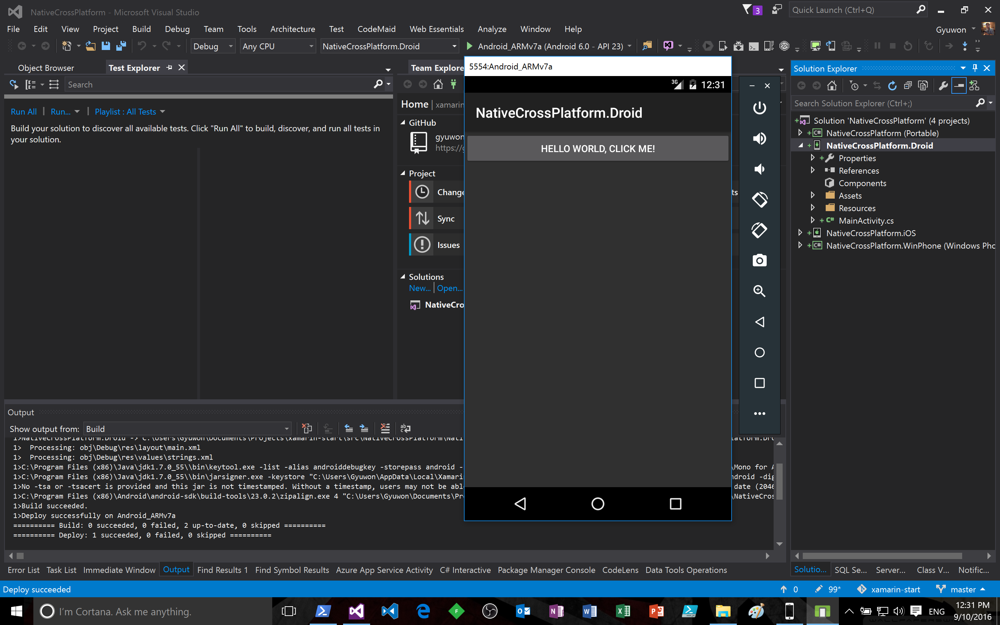

기능은 동일하지만 코드는 각각 정의되어 있습니다. 중복된 코드를 제거하기 위해 PCL(Portable Class Library) 프로젝트에 버튼을 누른 횟수를 관리하고 버튼에 출력될 메시지를 제공하는 `TapCounterService` 클래스를 추가합니다.

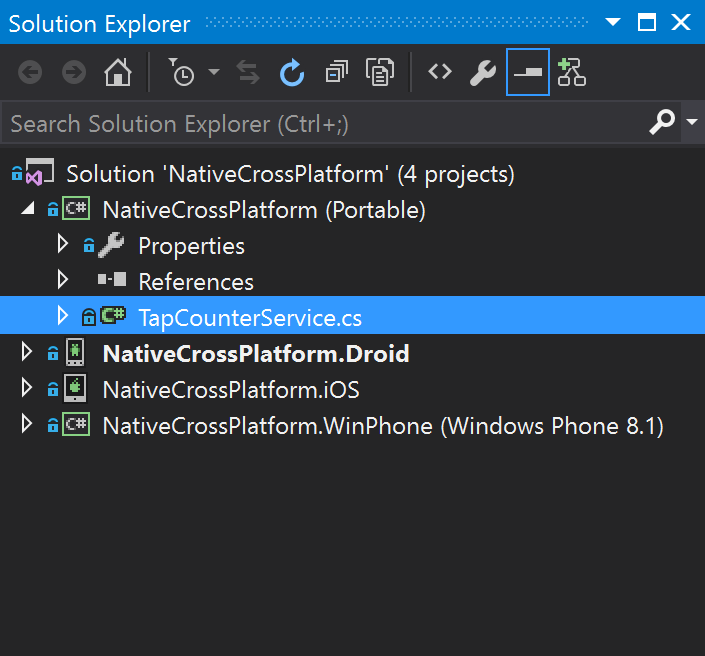

```csharp
namespace NativeCrossPlatform
{
    public class TapCounterService
    {
        private int _count;

        public int Count => _count;

        public string Message => $"{_count} clicks!";

        public void OnTap() => _count++;
    }
}
```

### iOS

`TapCounterService` 클래스를 사용해 iOS 프로젝트의 코드를 리팩터합니다.

```csharp
using System;
using UIKit;

namespace NativeCrossPlatform.iOS
{
    public partial class ViewController : UIViewController
    {
        private readonly TapCounterService _service = new TapCounterService();

        public ViewController(IntPtr handle) : base(handle)
        {
        }

        public override void ViewDidLoad()
        {
            base.ViewDidLoad();

            Button.AccessibilityIdentifier = "myButton";

            Button.TouchUpInside += delegate
            {
                _service.OnTap();
                Button.SetTitle(_service.Message, UIControlState.Normal);
            };
        }
    }
}
```

### Android

`TapCounterService` 클래스를 사용해 Android 프로젝트의 코드를 리팩터합니다.

```csharp
using Android.App;
using Android.OS;
using Android.Widget;

namespace NativeCrossPlatform.Droid
{
    [Activity(Label = "NativeCrossPlatform.Droid", MainLauncher = true, Icon = "@drawable/icon")]
    public class MainActivity : Activity
    {
        private readonly TapCounterService _service = new TapCounterService();

        protected override void OnCreate(Bundle bundle)
        {
            base.OnCreate(bundle);

            SetContentView(Resource.Layout.Main);

            var button = FindViewById<Button>(Resource.Id.myButton);

            button.Click += delegate
            {
                _service.OnTap();
                button.Text = _service.Message;
            };
        }
    }
}
```

## UI 테스팅

Xamarin은 크로스 플랫폼 UI 테스팅 도구인 Xamarin.UITest 패키지를 지원합니다.

### UI 테스트 프로젝트 추가

[File] -> [Add] -> [New Project] 메뉴를 선택합니다. 새 프로젝트 추가 대화상자에서 [Visual C#] -> [Test] 탭을 선택하고 [UI Test App (Xamarin.UITest | Cross Platform)] 항목을 선택해 프로젝트를 추가합니다.

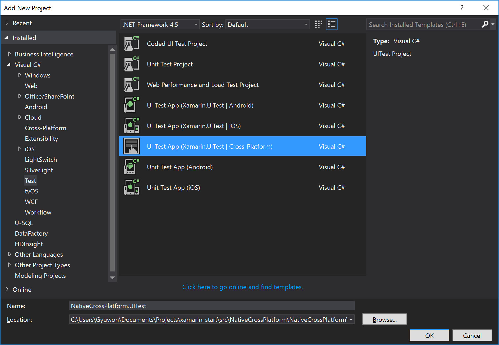

Xamarin UI 테스트는 [NUnit](http://www.nunit.org/)을 기반으로 합니다. Visual Studio에서 Xamarin UI 테스트를 실행하기 위해서는 NUnitTestAdapter 패키지를 설치되어 있어야 합니다.

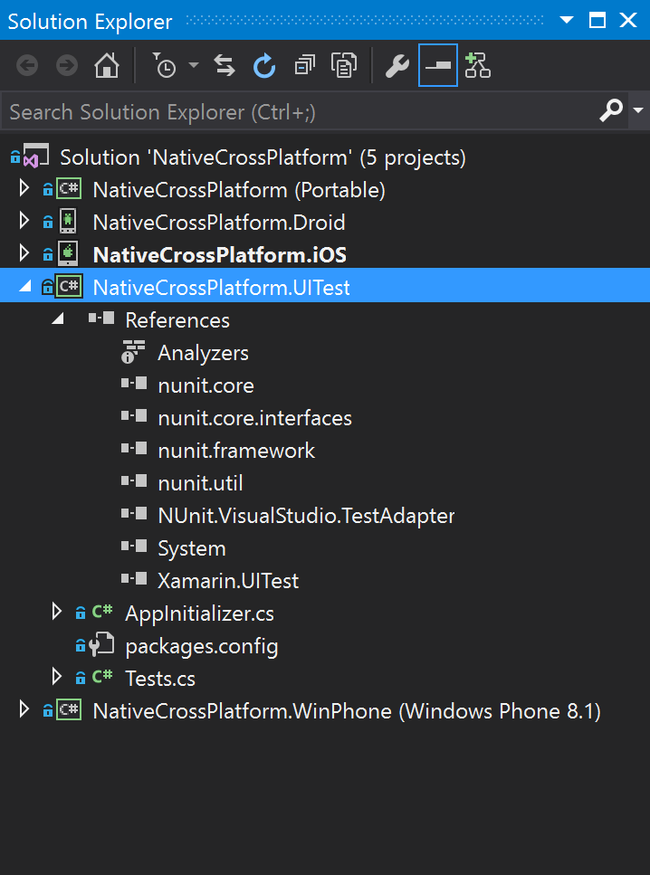

응용프로그램 메인 페이지에 대한 UI 테스트 케이스를 작성합니다.

```csharp
using System;
using System.Linq;
using NUnit.Framework;
using Xamarin.UITest;
using Xamarin.UITest.Queries;

namespace NativeCrossPlatform.UITest
{
    [TestFixture(Platform.Android)]
    [TestFixture(Platform.iOS)]
    public class MainPage_features
    {
        private Platform _platform;
        private IApp _app;

        public MainPage_features(Platform platform)
        {
            _platform = platform;
        }

        [SetUp]
        public void InitializeApp()
        {
            _app = AppInitializer.StartApp(_platform);
        }

        [Test]
        public void when_button_tapped_twice_then_its_label_changed()
        {
            // Arrange
            Func<AppQuery, AppQuery> buttonQuery = q => q.Button("myButton");

            // Act
            _app.Tap(buttonQuery);
            _app.Tap(buttonQuery);

            // Assert
            AppResult buttonResult = _app.Query(buttonQuery).Single();
            string actual = buttonResult.Text ?? buttonResult.Label;
            string expected = "2 clicks!";
            Assert.AreEqual(expected, actual);
        }
    }
}
```

`when_button_tapped_twice_then_its_label_changed` 테스트 케이스는 버튼을 두 번 탭했을 때 버튼 텍스트가 잘 변경되는지 검사합니다.

### UI 테스트 대상 프로젝트 참조 추가

UI 테스트를 실행하려면 UI 테스트 프로젝트에 테스트 대상 바이너리에 대한 정보를 제공해야합니다. 방법은 테스트 코드에 바이너리 경로를 지정하는 것과 프로젝트 참조는 추가하는 것이 있습니다. 예를 들어 UI 테스트 프로젝트에 다음 그림처럼 iOS 프로젝트와 Android 프로젝트에 대한 참조를 추가해 테스트 대상 응용프로그램을 지정합니다.

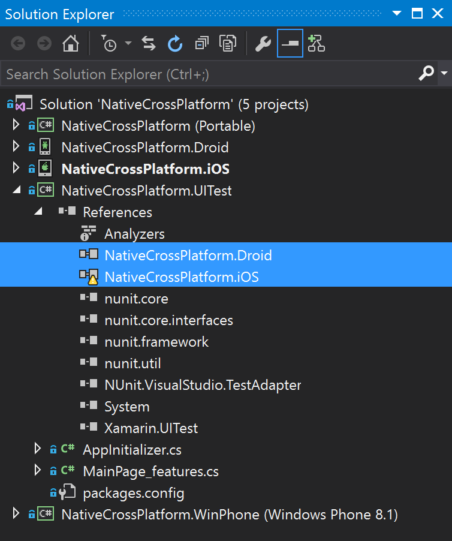

위 그림에 iOS 프로젝트 참조는 문제가 있는 것으로 표시됩니다. 이것을 프로젝트 빌드 대상 플랫폼 불일치로 인한 것입니다. 하지만 UI 테스트 프로젝트는 테스트 대상 프로젝트와 함께 빌드되는 것이 아니라 빌드가 완료된 바이너리를 실행시켜 진행하기 때문에 이 경고는 무시해도 됩니다. 대상 프로젝트 참조는 결과 바이너리 정보를 제공하는 것이 목적입니다.

Xamarin Android 프로젝트에 대한 테스트를 실행하면 다음과 같은 모습을 확인할 수 있습니다.

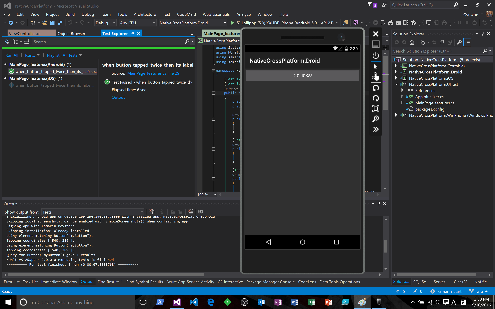

### iOS

Xamarin iOS 응용프로그램을 UI 테스트 하기 위해서는 [Calabash](https://developer.xamarin.com/guides/testcloud/calabash/introduction-to-calabash/)가 테스트 대상 프로젝트에 활성화되어야 합니다. Calabash는 Xamarin.TestCloud.Agent 패키지에 포함되어 있습니다. 이 패키지를 iOS 응용프로그램 프로젝트에 설치하고 `UIApplicationDelegate` 하위 클래스의 `FinishedLaunching()` 메서드에서 Calabash를 시작합니다. 이 때 `#if` 전처리기와 `DEBUG` 등의 컴파일 기호를 사용해 배포용 바이너리에서는 적용되지 않도록 하는 것이 좋습니다.

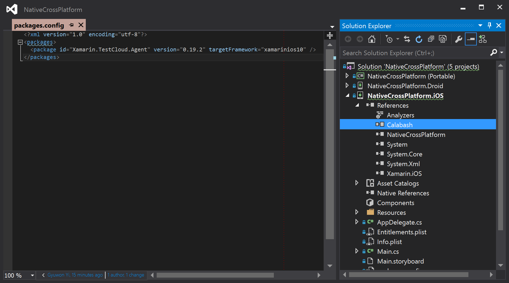

```csharp
using Foundation;
using UIKit;

namespace NativeCrossPlatform.iOS
{
    [Register ("AppDelegate")]
    public class AppDelegate : UIApplicationDelegate
    {
        public override UIWindow Window {
            get;
            set;
        }

        public override bool FinishedLaunching (UIApplication application, NSDictionary launchOptions)
        {
#if DEBUG
            Xamarin.Calabash.Start();
#endif

            return true;
        }
    }
}
```

현재 Xamarin iOS 응용프로그램 UI 테스트는 Windows 환경을 지원하지 않기 때문에 OSX 운영체제가 필요합니다.

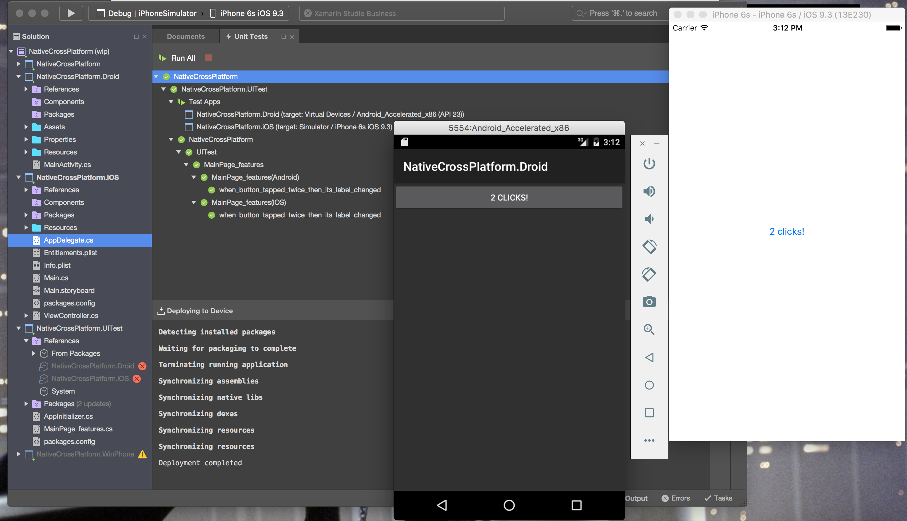 

# Xamarin.Forms 크로스 플랫폼

Xamarin Forms를 사용하면 크로스 플랫폼 UI 코드를 작성할 수 있습니다. 응용프로그램 논리 뿐 아니라 뷰도 하나의 코드를 iOS와 Android 플랫폼을 대상으로 제공할 수 있습니다.

## 프로젝트 생성

[File] -> [New] -> [Project] 메뉴를 선택합니다. 새 프로젝트 대화상자에서 [Visual C#] -> [Cross-Platform] 탭을 선택하고 [Blank Xaml App (Xamarin.Forms Portable)]  항목을 선택해 프로젝트를 생성합니다.

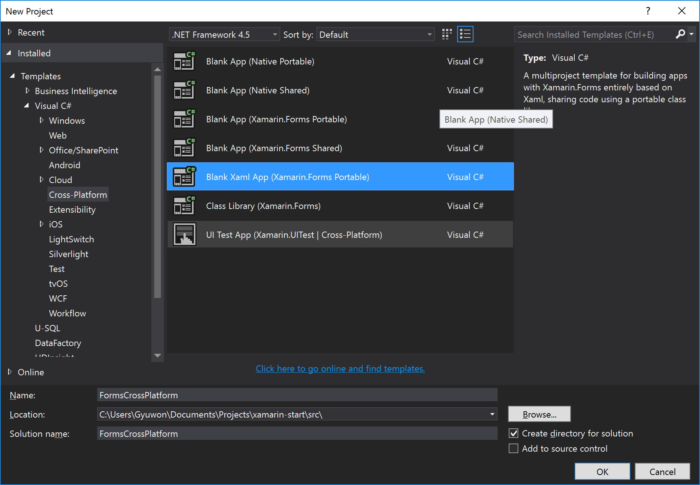

프로젝트가 생성되면 솔루션에 다음과 같은 프로젝트 목록이 보입니다.

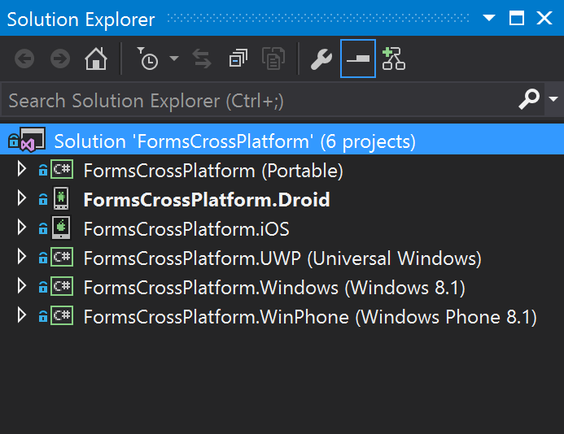

## 패키지 업데이트

생성된 프로젝트가 최신 버전의 Xamarin Forms 패키지를 참조하지 않을 수 있습니다. Xamarin Forms의 모든 기능을 사용하려면 패키지를 업데이트하는 것이 좋습니다. 솔루션 nuget 패키지 관리자를 사용하면 솔루션의 모든 프로젝트에 대해 패키지를 관리할 수 있습니다. 솔루션 컨텍스트 메뉴에서 [Manage NuGet Packages for Solution...] 항목을 선택합니다.

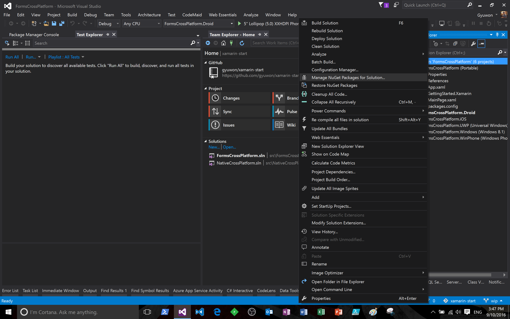

솔루션 nuget 패키지 관리자에서 Xamarin Forms 패키지 구 버전을 사용하는 모든 프로젝트를 선택해 최신 버전을 설치합니다.

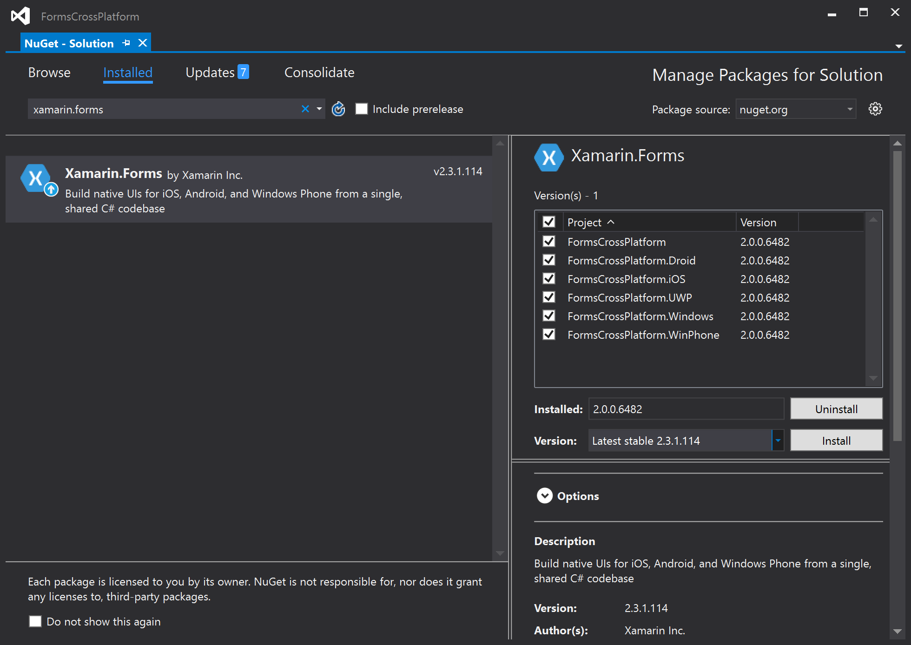

## XAML 뷰

Xamarin Forms는 [XAML(Extensible Application Markup Language)](https://developer.xamarin.com/guides/xamarin-forms/xaml/xaml-basics/)을 지원합니다. XAML을 사용해 크로스 플랫폼 UI 코드를 작성할 수 있습니다.

다음 XAML 코드를 크로스 플랫폼 프로젝트의 MainPage.xaml 파일에 작성합니다. 

```xaml
<?xml version="1.0" encoding="utf-8" ?>
<ContentPage xmlns="http://xamarin.com/schemas/2014/forms"
             xmlns:x="http://schemas.microsoft.com/winfx/2009/xaml"
             xmlns:local="clr-namespace:FormsCrossPlatform"
             x:Class="FormsCrossPlatform.MainPage">

  <Grid>
    <Grid.RowDefinitions>
      <RowDefinition Height="Auto" />
      <RowDefinition Height="*" />
    </Grid.RowDefinitions>

    <Grid>
      <Grid.ColumnDefinitions>
        <ColumnDefinition Width="Auto" />
        <ColumnDefinition Width="*" />
      </Grid.ColumnDefinitions>

      <Label Text="Name: " />
      <Entry Grid.Column="1" />

      <Label Grid.Row="1" Text="Email: " />
      <Entry Grid.Row="1" Grid.Column="1" />

      <Button Grid.Row="2" Grid.ColumnSpan="2" Text="Add" />
    </Grid>

    <ListView Grid.Row="1" BackgroundColor="#dfdfdf" />
  </Grid>

</ContentPage>
```

이 XAML 코드는 이름과 이메일 주소가 포함된 연락처를 구성하는 UI를 제공합니다.

이후 Xamarin Android 프로젝트를 실행하면 다음과 같은 화면을 볼 수 있습니다.

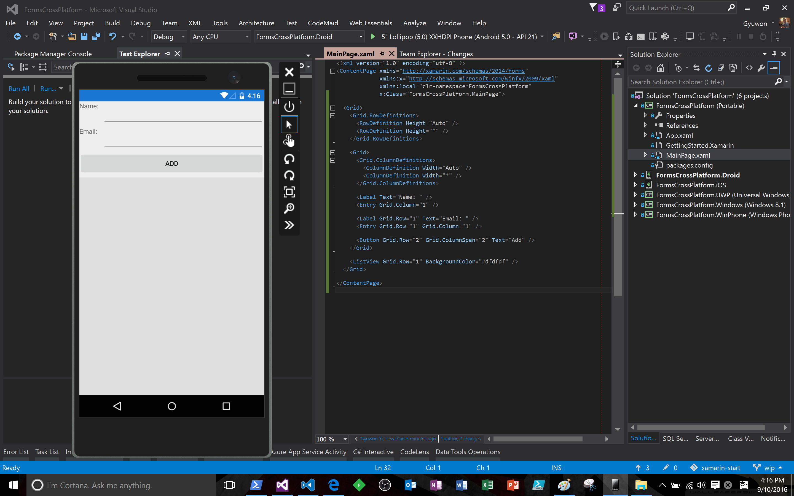

Xamarin Android 프로젝트의 코드는 전혀 수정하지 않았습니다.

## `Device.OnPlatform<T>`

동일한 코드를 Xamarin iOS 프로젝트를 통해 실행하면 다음과 같은 화면은 볼 수 있습니다.

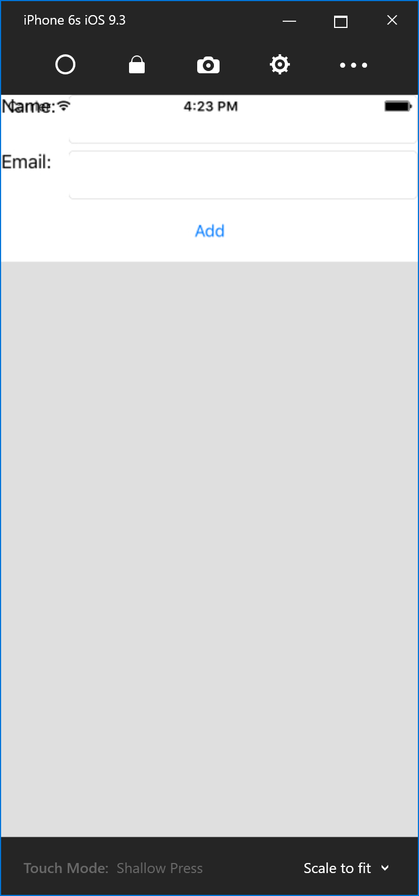

실행된 결과는 Xamarin Android 응용프로그램에서는 볼 수 없었던 문제점을 가지고 있습니다. 응용프로그램 UI 일부가 iOS 상태 막대와 겹쳐집니다. 이런 유형의 문제를 해결하기 위해 `OnPlatform` 코드를 크로스 플랫폼 코드에 사용할 수 있습니다. 다음 코드는 XAML을 이용해 iOS 플랫폼에 대해서만 페이지 여백을 설정하는 방법을 보여줍니다.

```xaml
<?xml version="1.0" encoding="utf-8" ?>
<ContentPage xmlns="http://xamarin.com/schemas/2014/forms"
             xmlns:x="http://schemas.microsoft.com/winfx/2009/xaml"
             xmlns:local="clr-namespace:FormsCrossPlatform"
             x:Class="FormsCrossPlatform.MainPage">
  
  <ContentPage.Padding>
    <OnPlatform x:TypeArguments="Thickness" iOS="0,20,0,0" />
  </ContentPage.Padding>

  ...

</ContentPage>
```

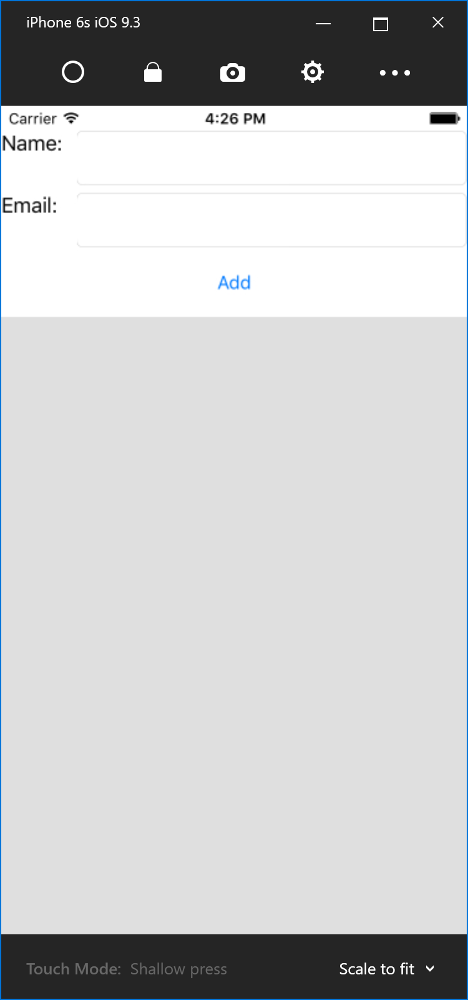

> [Essential XAML Syntax](https://developer.xamarin.com/guides/xamarin-forms/xaml/xaml-basics/essential_xaml_syntax/) 참고

##  응용프로그램 논리

XAML 파일은 동일한 이름에 'cs' 확장자를 가지는 C# 코드 파일과 연결됩니다. 이 파일을 통해 UI 페이지의 논리를 구성할 수 있습니다.

우선 크로스 플랫폼 프로젝트에 연락처를 나타내는 모델 클래스를 추가합니다.

```csharp
using System;

namespace FormsCrossPlatform
{
    public class Contact
    {
        public Contact(string name, string email)
        {
            if (null == name)
                throw new ArgumentNullException(nameof(name));
            if (null == email)
                throw new ArgumentNullException(nameof(email));

            Name = name;
            Email = email;
        }

        public string Name { get; }

        public string Email { get; }
    }
}
```

XAML 파일(MainPage.xaml)과 연결된 C# 코드 파일(MainPage.xaml.cs)에서 XAML 요소를 사용하려면 사용하려는 요소에 `x:Name` 특성을 사용해 이름을 지정해줍니다. 이 이름은 페에지 클래스에서 필드 이름으로 사용됩니다. 이 대응 작업은 Xamarin 개발 도구가 해주므로 XAML에서 이름을 지정한 후 즉시 C# 코드에서 사용 가능합니다.

```xaml
<?xml version="1.0" encoding="utf-8" ?>
<ContentPage xmlns="http://xamarin.com/schemas/2014/forms"
             xmlns:x="http://schemas.microsoft.com/winfx/2009/xaml"
             xmlns:local="clr-namespace:FormsCrossPlatform"
             x:Class="FormsCrossPlatform.MainPage">
  
  <ContentPage.Padding>
    <OnPlatform x:TypeArguments="Thickness" iOS="0,20,0,0" />
  </ContentPage.Padding>

  <Grid>
    <Grid.RowDefinitions>
      <RowDefinition Height="Auto" />
      <RowDefinition Height="*" />
    </Grid.RowDefinitions>

    <Grid>
      <Grid.ColumnDefinitions>
        <ColumnDefinition Width="Auto" />
        <ColumnDefinition Width="*" />
      </Grid.ColumnDefinitions>

      <Label Text="Name: " />
      <Entry x:Name="_name" Grid.Column="1" />

      <Label Grid.Row="1" Text="Email: " />
      <Entry x:Name="_email" Grid.Row="1" Grid.Column="1" />

      <Button x:Name="_add" Grid.Row="2" Grid.ColumnSpan="2" Text="Add" />
    </Grid>

    <ListView x:Name="_contactList" Grid.Row="1" BackgroundColor="#dfdfdf">
      <ListView.ItemTemplate>
        <DataTemplate>
          <ViewCell>
            <Grid>
              <Label Text="{Binding Name}" />
              <Label Grid.Column="1" Text="{Binding Email}" />
            </Grid>
          </ViewCell>
        </DataTemplate>
      </ListView.ItemTemplate>
    </ListView>
  </Grid>

</ContentPage>
```

XAML 코드에서 정의한 UI 요소의 이름을 사용해 C# 코드에 응용프로그램 논리를 작성합니다.

```csharp
using System.Collections.ObjectModel;
using Xamarin.Forms;

namespace FormsCrossPlatform
{
    public partial class MainPage : ContentPage
    {
        private readonly ObservableCollection<Contact> _contacts;

        public MainPage()
        {
            InitializeComponent();

            _contacts = new ObservableCollection<Contact>();

            _contactList.ItemsSource = _contacts;

            _add.Clicked += delegate
            {
                if (string.IsNullOrWhiteSpace(_name.Text) ||
                    string.IsNullOrWhiteSpace(_email.Text))
                    return;

                _contacts.Add(new Contact(_name.Text, _email.Text));

                _name.Text = string.Empty;
                _email.Text = string.Empty;
            };
        }
    }
}
```

여기까지 작성한 후 iOS 응용프로그램이나 Android 응용프로그램을 실행하면 연락처 추가 논리가 동작하는 것을 확인할 수 있습니다.

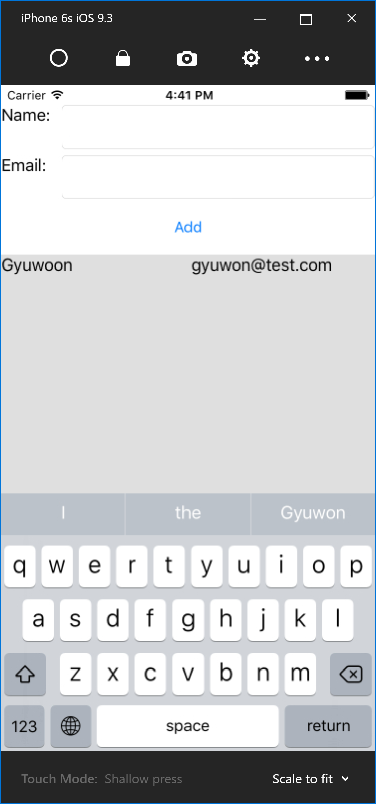

## 효과(Efect)

[효과(Effect)](https://developer.xamarin.com/guides/xamarin-forms/effects/introduction/)는 Xamarin Forms를 사용해 작성된 크로스 플랫폼 UI에 간단한 특정 플랫폼 특유의 효과를 적용하기 위해 사용됩니다. 먼저 크로스 플랫폼 UI 계층에서 효과를 정의하고 UI 요소에 추가한 후 이 효과를 구현하고자 하는 플랫폼에서 연관된 플랫폼 효과를 작성합니다.

다음 코드에 보여지는 `FocusEffect` 효과를 크로스 플랫폼 프로젝트에 작성합니다. 이 클래스는 텍스트 입력 UI가 포커스를 가질 때 시각적 효과를 보강하는 역할을 정의합니다. 구현은 각 플랫폼 코드가 담당합니다.

```csharp
using Xamarin.Forms;

namespace FormsCrossPlatform
{
    public class FocusEffect : RoutingEffect
    {
        public FocusEffect()
            : base($"{nameof(FormsCrossPlatform)}.{nameof(FocusEffect)}")
        {
        }
    }
}
```

> 예제에서는 효과 식별자를 네임스페이스와 클래스 이름으로 구성합니다. 효과 식별자에 대해서는 [이 문서(Creating an Effect)](https://developer.xamarin.com/guides/xamarin-forms/effects/creating/)를 참고하세요.

`FocusEffect` 클래스는 `FormsCrossPlatform` 네임스페이스에 정의되며 XAML에서 사용하려면 XML 네임스페이스를 지정해줘야합니다. 프로젝트 생성시 기본 네임스페이스가 `local` XML 네임스페이스로 지정되어있기 때문에 이 경우는 별도로 해 줄 일은 없지만 코드를 살펴보면 다음과 같습니다.

```xaml
<ContentPage xmlns="http://xamarin.com/schemas/2014/forms"
             xmlns:x="http://schemas.microsoft.com/winfx/2009/xaml"
             xmlns:local="clr-namespace:FormsCrossPlatform"
             x:Class="FormsCrossPlatform.MainPage">
```

`FocusEffect`를 `Entry` 요소에 적용합니다.

```xaml
<Label Text="Name: " />
<Entry x:Name="_name" Grid.Column="1">
  <Entry.Effects>
    <local:FocusEffect />
  </Entry.Effects>
</Entry>

<Label Grid.Row="1" Text="Email: " />
<Entry x:Name="_email" Grid.Row="1" Grid.Column="1">
  <Entry.Effects>
    <local:FocusEffect />
  </Entry.Effects>        
</Entry>
```

### iOS 효과 구현

iOS 플랫폼을 위한 `FocusEffect` 구현체를 작성합니다. Xamarin iOS 프로젝트에 다음 클래스를 추가합니다.

```csharp
using System.ComponentModel;
using FormsCrossPlatform;
using FormsCrossPlatform.iOS;
using UIKit;
using Xamarin.Forms;
using Xamarin.Forms.Platform.iOS;

[assembly:ResolutionGroupName(nameof(FormsCrossPlatform))]
[assembly:ExportEffect(typeof(PlatformFocusEffect), nameof(FocusEffect))]

namespace FormsCrossPlatform.iOS
{
    public class PlatformFocusEffect : PlatformEffect
    {
        protected override void OnAttached()
        {
        }

        protected override void OnDetached()
        {
        }

        protected override void OnElementPropertyChanged(
            PropertyChangedEventArgs args)
        {
            base.OnElementPropertyChanged(args);

            if (args.PropertyName == nameof(Entry.IsFocused))
            {
                var entry = (Entry)Element;
                Control.BackgroundColor =
                    entry.IsFocused
                    ? UIColor.Yellow
                    : UIColor.White;
            }
        }
    }
}
```

이제 iOS 응용프로그램을 실행하면 아래 그림과 같은 모습을 확인할 수 있습니다.

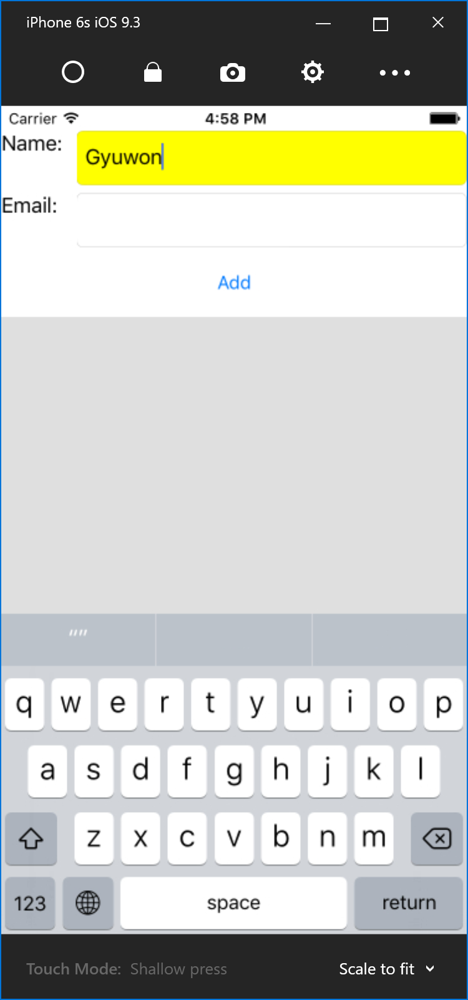

> `Entry` 요소의 배경색을 변경하는 작업은 Xamarin Forms 계층에서로 할 수 있습니다. 다만 여기서는 플랫폼 효과를 쉽게 설명하기 위해 배경색 변경을 사용합니다.

### Android 효과 구현

Android 플랫폼을 위한 `FocusEffect` 구현체를 작성합니다. Xamarin Android 프로젝트에 다음 클래스를 추가합니다.

```csharp
using System.ComponentModel;
using FormsCrossPlatform;
using FormsCrossPlatform.Droid;
using Xamarin.Forms;
using Xamarin.Forms.Platform.Android;

[assembly: ResolutionGroupName(nameof(FormsCrossPlatform))]
[assembly: ExportEffect(typeof(PlatformFocusEffect), nameof(FocusEffect))]

namespace FormsCrossPlatform.Droid
{
    public class PlatformFocusEffect : PlatformEffect
    {
        protected override void OnAttached()
        {
        }

        protected override void OnDetached()
        {
        }

        protected override void OnElementPropertyChanged(
            PropertyChangedEventArgs args)
        {
            base.OnElementPropertyChanged(args);

            if (args.PropertyName == nameof(Entry.IsFocused))
            {
                var entry = (Entry)Element;
                Control.SetBackgroundColor(
                    entry.IsFocused
                    ? Android.Graphics.Color.Yellow
                    : Android.Graphics.Color.White);
            }
        }
    }
}
```

이제 Android 응용프로그램을 실행하면 아래 그림과 같은 모습을 확인할 수 있습니다.

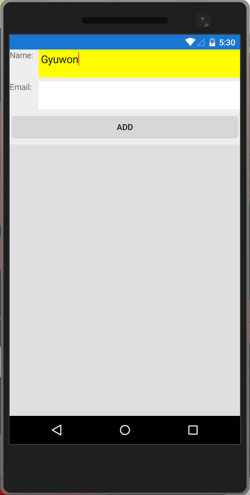

> `Entry` 요소의 배경색을 변경하는 작업은 Xamarin Forms 계층에서로 할 수 있습니다. 다만 여기서는 플랫폼 효과를 쉽게 설명하기 위해 배경색 변경을 사용합니다.

## MVVM(Model View ViewModel) 패턴

MVVM 패턴을 사용하면 UI와 관련된 부분을 포함해 응용프로그램 논리의 많은 부분을 뷰모델로 분리할 수 있습니다. 뷰모델은 뷰(UI)에 종속적이지 않기 때문에 단위 테스트하기 쉽습니다. XAML을 사용한 응용프로그램은 MVVM 패턴을 적용하기 적합합니다.

### 뷰모델 프로젝트 추가

뷰모델 계층은 뷰 계층과 같은 프로젝트에 작성되어도 되지만 이 경우 프로그래머는 뷰 종속적인 코드를 뷰모델에 포함시키는 실수를 저지르거나 유혹에 빠질 수 있습니다. 따라서 될 수 있으면 이런 행위가 물리적으로 불가능하도록 별도의 프로젝트를 만드는 것이 권장됩니다.

[File] -> [Add] -> [New Project] 메뉴를 선택합니다. 새 프로젝트 추가 대화상자에서 [Visual C#] 탭을 선택하고 [Class Library (Portable)] 항목을 선택해 프로젝트를 추가합니다.

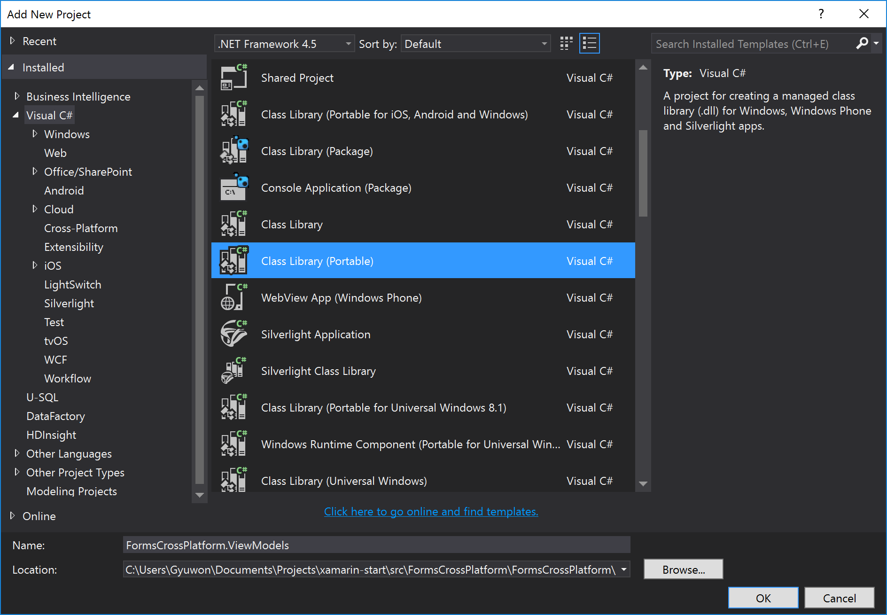

뷰모델 프로젝트의 대상 플랫폼은 아래 그림처럼 설정합니다. 대상 플랫폼 목록은 Xamarin Forms 프로젝트와 동일하게 맞추면 됩니다. 대상 플랫폼은 프로젝트 생성후에도 프로젝트 속성 화면에서 변경할 수 있습니다.

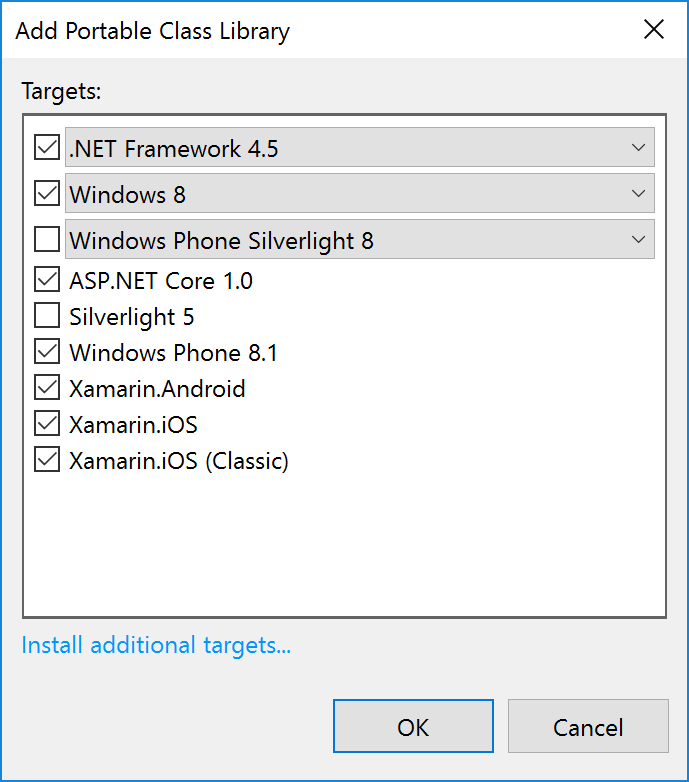

### MVVM 패턴 도구

MVVM 패턴에 자주 사용되는 코드를 도구로 만들 수 있습니다. MVVM을 지원하는 패키지를 설치할 수도 있지만 여기서는 간단한 클래스를 직접 작성합니다.

#### `ObservableObject`

간단한 `INotifyPropertyChanged` 인터페이스 구현체를 작성합니다.

```csharp
using System.Collections.Generic;
using System.ComponentModel;
using System.Runtime.CompilerServices;

namespace FormsCrossPlatform.ViewModels
{
    public abstract class ObservableObject : INotifyPropertyChanged
    {
        protected bool Set<T>(
            ref T field,
            T value,
            [CallerMemberName] string propertyName = null)
        {
            if (EqualityComparer<T>.Default.Equals(field, value))
                return false;

            field = value;

            PropertyChanged?.Invoke(
                this,
                new PropertyChangedEventArgs(propertyName));

            return true;
        }

        public event PropertyChangedEventHandler PropertyChanged;
    }
}
```

#### `RelayCommand`

간단한 `ICommand` 인터페이스 구현체를 작성합니다.

```csharp
using System;
using System.Windows.Input;

namespace FormsCrossPlatform.ViewModels
{
    public class RelayCommand : ICommand
    {
        private readonly Action<object> _execute;
        private readonly Func<object, bool> _canExecute;

        public RelayCommand(Action<object> execute)
            : this(execute, p => true)
        {
        }

        public RelayCommand(
            Action<object> execute,
            Func<object, bool> canExecute)
        {
            if (null == execute)
                throw new ArgumentNullException(nameof(execute));
            if (null == canExecute)
                throw new ArgumentNullException(nameof(canExecute));

            _execute = execute;
            _canExecute = canExecute;
        }

        public event EventHandler CanExecuteChanged;

        public bool CanExecute(object parameter) =>
            _canExecute.Invoke(parameter);

        public void Execute(object parameter) =>
            _execute.Invoke(parameter);

        public void RaiseCanExecuteChanged() =>
            CanExecuteChanged?.Invoke(this, EventArgs.Empty);
    }
}
```

### 뷰모델 작성

Xamarin Forms 예제 응용프로그램은 사용자 이름과 이메일 주소를 입력받아 연락처 목록에 추가하는 기능을 가집니다. 기존에는 이 논리가 UI(페이지) 클래스에 구현되어 있었습니다. 이제 주 페이지를 추상화하는 `MainViewModel` 클래스에 응용프로그램 논리를 작성합니다.

```csharp
using System.Collections.ObjectModel;
using System.Windows.Input;

namespace FormsCrossPlatform.ViewModels
{
    public class MainViewModel : ObservableObject
    {
        private string _name;
        private string _email;

        public MainViewModel()
        {
            Contacts = new ObservableCollection<Contact>();

            Add = new RelayCommand(p =>
            {
                if (string.IsNullOrWhiteSpace(Name) ||
                    string.IsNullOrWhiteSpace(Email))
                    return;

                Contacts.Add(new Contact(Name, Email));

                Name = string.Empty;
                Email = string.Empty;
            });
        }

        public string Name
        {
            get { return _name; }
            set { Set(ref _name, value); }
        }

        public string Email
        {
            get { return _email; }
            set { Set(ref _email, value); }
        }

        public ObservableCollection<Contact> Contacts { get; }

        public ICommand Add { get; }
    }
}
```

`MainViewModel`은 4개의 공용(public)으로 노출된 속성을 가집니다.

- `Name`: 이름을 입력하는 UI에 대응됩니다.
- `Email`: 이메일 주소를 입력하는 UI에 대응됩니다.
- `Add`: 연락처를 추가하는 버튼에 대응됩니다.
- `Contacts`: 연락처 목록 UI에 대응됩니다.

이렇듯 뷰모델은 뷰(UI)를 추상화하는 역할을 담당합니다.

### 뷰 리팩터링

뷰모델을 바인딩하도록 뷰를 수정합니다. 페이지의 논리를 가지던 C# 코드를 다음과 같이 초기 상태로 되돌립니다.

```csharp
using Xamarin.Forms;

namespace FormsCrossPlatform
{
    public partial class MainPage : ContentPage
    {
        public MainPage()
        {
            InitializeComponent();
        }
    }
}
```

> 이런 상태를 'UI의 zero code'라고 부릅니다. MVVM 패턴을 사용하면 뷰의 코드가 크게 줄어들고 많은 경우 논리를 전혀 가지지 않게됩니다. 하지만 'UI의 zero code'는 MVVM 패턴은 결과이지 목적이 아닙니다. 이것을 기억하지 않으면 과도한 엔지니어링에 빠지기 쉽습니다.

XAML 파일은 더이상 사용되지 않는 `x:Name` 특성을 제거하고 대신 페이지의 `BindingContext`를 설정하고 각 UI 요소들을 뷰모델 속성에 바인딩합니다. 이 때 `MainViewModel`은 뷰모델 프로젝트의 `FormsCrossPlatform.ViewModels` 네임스페이스에 있기 때문에 XML 네임스페이스를 추가해야 합니다.

```xaml
<?xml version="1.0" encoding="utf-8" ?>
<ContentPage xmlns="http://xamarin.com/schemas/2014/forms"
             xmlns:x="http://schemas.microsoft.com/winfx/2009/xaml"
             xmlns:local="clr-namespace:FormsCrossPlatform"
             xmlns:vm="clr-namespace:FormsCrossPlatform.ViewModels;assembly=FormsCrossPlatform.ViewModels"
             x:Class="FormsCrossPlatform.MainPage">

  <ContentPage.BindingContext>
    <vm:MainViewModel />
  </ContentPage.BindingContext>
  
  <ContentPage.Padding>
    <OnPlatform x:TypeArguments="Thickness" iOS="0,20,0,0" />
  </ContentPage.Padding>

  <Grid>
    <Grid.RowDefinitions>
      <RowDefinition Height="Auto" />
      <RowDefinition Height="*" />
    </Grid.RowDefinitions>

    <Grid>
      <Grid.ColumnDefinitions>
        <ColumnDefinition Width="Auto" />
        <ColumnDefinition Width="*" />
      </Grid.ColumnDefinitions>

      <Label Text="Name: " />
      <Entry Grid.Column="1" Text="{Binding Name}">
        <Entry.Effects>
          <local:FocusEffect />
        </Entry.Effects>
      </Entry>

      <Label Grid.Row="1" Text="Email: " />
      <Entry Grid.Row="1" Grid.Column="1" Text="{Binding Email}">
        <Entry.Effects>
          <local:FocusEffect />
        </Entry.Effects>        
      </Entry>

      <Button Grid.Row="2" Grid.ColumnSpan="2" Text="Add" Command="{Binding Add}" />
    </Grid>

    <ListView Grid.Row="1" BackgroundColor="#dfdfdf" ItemsSource="{Binding Contacts}">
      <ListView.ItemTemplate>
        <DataTemplate>
          <ViewCell>
            <Grid>
              <Label Text="{Binding Name}" />
              <Label Grid.Column="1" Text="{Binding Email}" />
            </Grid>
          </ViewCell>
        </DataTemplate>
      </ListView.ItemTemplate>
    </ListView>
  </Grid>

</ContentPage>
```

응용프로그램을 실행하면 MVVM 패턴을 적용하기 전과 동일한 동작을 확인할 수 있습니다.

### 단위 테스팅

MVVM 패턴을 사용하면 응용프로그램의 논리의 전부 혹은 대부분이 UI에 독립적인 뷰모델에 작성되기 때문에 단위 테스트하기 쉽습니다. 동일한 논리를 대상으로 테스트할 때 단위 테스트 케이스는 UI 테스트 케이스에 비해 적게는 수십배에서 크게는 10000배 이상 빠릅니다.

> 단위 테스트와 UI 테스트는 각각 장단점을 가집니다. 이상적인 방법은 둘 모두를 학습한 후 적절히 사용하는 것입니다.

#### 단위 테스트 프로젝트 추가

[File] -> [Add] -> [New Project] 메뉴를 선택합니다. 새 프로젝트 추가 대화상자에서 [Visual C#] -> [Test] 탭을 선택하고 [Class Library (Portable)] 항목을 선택해 프로젝트를 추가합니다.

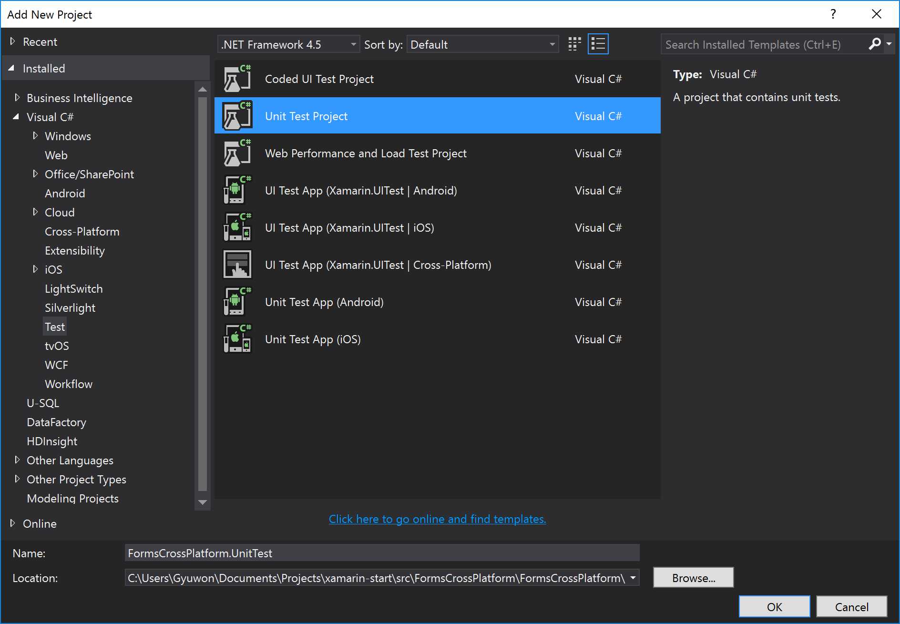

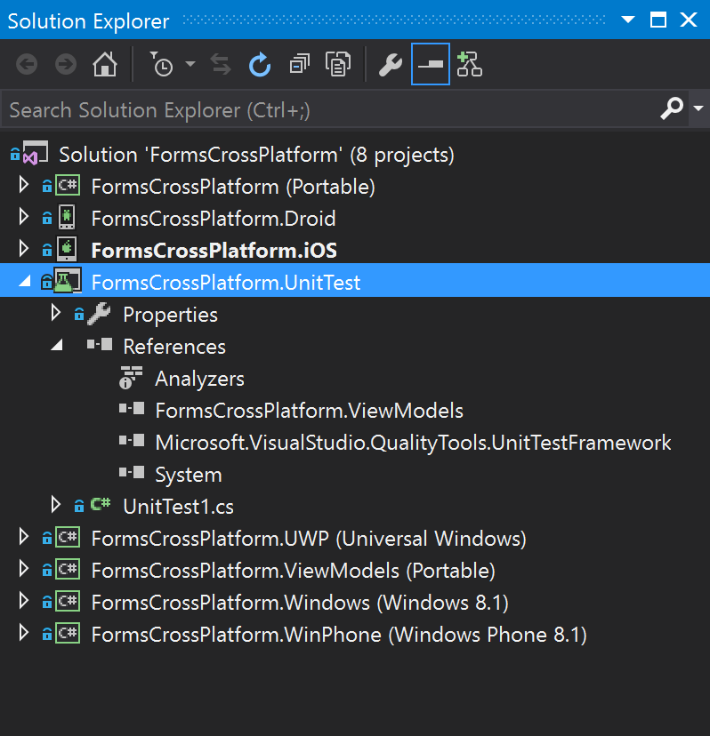

> 이렇게 추가된 테스트 프로젝트는 MSTest를 테스트 프레임워크를 사용합니다. Xamarin Studio에서도 단위 테스팅을 하려면 NUnit을 사용하도록 프로젝트를 구성해야합니다.

테스트 케이스 검증 논리를 보다 직관적으로 작성하기 위해 단위 테스트 프로젝트에 'FluentAssertions` 패키지를 설치합니다. 단위 테스트 프로젝트 컨텍스트 메뉴에서 [Quick Install Package...] 항목을 선택해 패키지를 설치합니다.

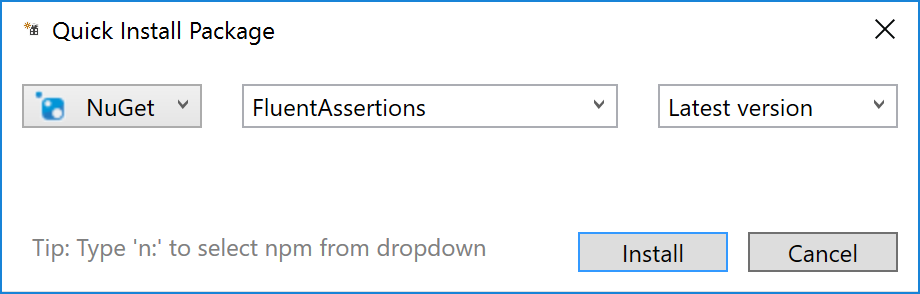

#### 단위 테스트 케이스 작성

단위 테스트 프로젝트에 다음 코드를 추가합니다.

```csharp
using System.Linq;
using FluentAssertions;
using FormsCrossPlatform.ViewModels;
using Microsoft.VisualStudio.TestTools.UnitTesting;

namespace FormsCrossPlatform.UnitTest
{
    [TestClass]
    public class MainViewModel_features
    {
        [TestMethod]
        public void given_name_is_empty_when_Add_executed_then_no_contact_added()
        {
            // Arrange
            var sut = new MainViewModel();
            sut.Name = string.Empty;

            // Act
            sut.Add.Execute(null);

            // Assert
            sut.Contacts.Should().BeEmpty();
        }

        [TestMethod]
        public void given_email_is_empty_when_Add_executed_then_no_contact_added()
        {
            // Arrange
            var sut = new MainViewModel();
            sut.Email = string.Empty;

            // Act
            sut.Add.Execute(null);

            // Assert
            sut.Contacts.Should().BeEmpty();
        }

        [TestMethod]
        public void when_Add_executed_then_new_contact_added_correctly()
        {
            // Arrange
            var sut = new MainViewModel();
            sut.Name = "Tony Stark";
            sut.Email = "ironman@avengers.com";

            // Act
            sut.Add.Execute(null);

            // Assert
            sut.Contacts.Should().HaveCount(1);
            sut.Contacts.Single().Name.Should().Be("Tony Stark");
            sut.Contacts.Single().Email.Should().Be("ironman@avengers.com");
        }

        [TestMethod]
        public void when_Add_exeuted_then_entry_fields_cleared()
        {
            // Arrange
            var sut = new MainViewModel();
            sut.Name = "Tony Stark";
            sut.Email = "ironman@avengers.com";

            // Act
            sut.Add.Execute(null);

            // Assert
            sut.Name.Should().BeEmpty();
            sut.Email.Should().BeEmpty();
        }
    }
}
```

각 테스트 케이스가 검증하는 논리는 다음과 같습니다.

- `given_name_is_empty_when_Add_executed_then_no_contact_added`<br />이름이 입력되지 않은 상태에서 추가 버튼을 누르면 연락처가 추가되지 않습니다.
- `given_email_is_empty_when_Add_executed_then_no_contact_added`<br />이메일 주소가 입력되지 않은 상태에서 추가 버튼을 누르면 연락처가 추가되지 않습니다.
- `when_Add_executed_then_new_contact_added_correctly`<br />이름과 이메일이 입력된 상태에서 추가 버튼을 누르면 연락처가 추가됩니다.
- `when_Add_exeuted_then_entry_fields_cleared`<br />추가 버튼을 누르면 이름 필드와 이메일 주소 필드가 초기화됩니다.

단위 테스트를 실행하면 모든 테스트 케이스가 성공합니다.

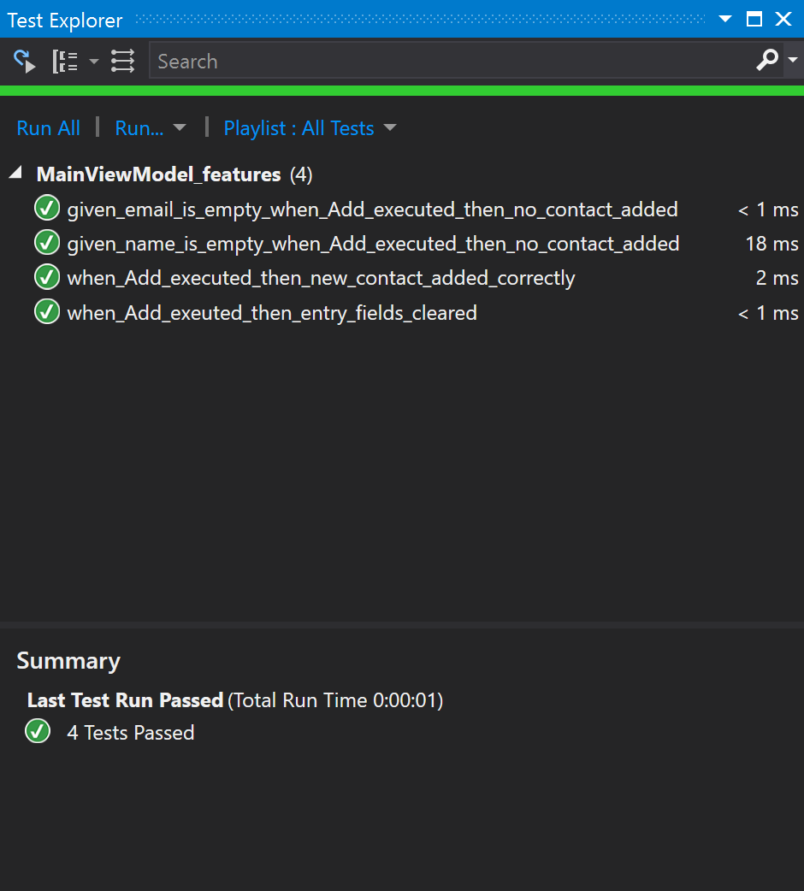

## 의존성 역전 원리(Dependency Inversion Principle)

Xamarin Forms는 의존성 역전 원리를 지원하기 위한 단순한 IoC(Inversion of Control)컨테이너인 `DependencyService` 클래스를 제공합니다.

각 플랫폼 별로 제공되는 응용프로그램의 이벤트를 기록하는 기능을 크로스 플랫폼 계층에서 사용하기 위해 `DependencyService` 클래스를 사용할 수 있습니다.

뷰모델 프로젝트에 이벤트 기록 기능을 추상화하는 인터페이스를 정의합니다.

```csharp
namespace FormsCrossPlatform.ViewModels
{
    public interface IEventTracker
    {
        void TrackEvent(string eventName);
    }
}
```

`MainViewModel` 클래스에 `IEventTracker`를 사용해 연락처 추가 이벤트(`"ContactAdded"`)를 기록하는 논리를 추가합니다. 만약 `IEventTracker`가 제공되지 않으면 이벤트를 기록하지 않습니다. 다음과 같이 `MainViewModel` 생성자를 수정합니다.

```csharp
public MainViewModel(IEventTracker tracker = null)
{
    Contacts = new ObservableCollection<Contact>();

    Add = new RelayCommand(p =>
    {
        if (string.IsNullOrWhiteSpace(Name) ||
            string.IsNullOrWhiteSpace(Email))
            return;

        Contacts.Add(new Contact(Name, Email));

        Name = string.Empty;
        Email = string.Empty;

        tracker?.TrackEvent("ContactAdded");
    });
}
```

`MainViewModel` 인스턴스를 생성할 때 `IEventTracker` 서비스를 제공하기 위해 뷰 코드를 수정합니다. 먼저 XAML 코드에서 다음 `BindingContext`를 설정하는 코드를 삭제합니다.

```xaml
  <ContentPage.BindingContext>
    <vm:MainViewModel />
  </ContentPage.BindingContext>
```

대신 C# 코드에서 `DependencyService`를 이용해 뷰모델을 생성하고 `BindingContext`에 대입합니다.

```csharp
public MainPage()
{
    InitializeComponent();

    BindingContext = new MainViewModel(
        DependencyService.Get<IEventTracker>());
}
```

아직 `IEventTracker` 인터페이스에 대한 구현체가 작성되지 않았기 때문에 `DependencyService.Get<IEventTracker>()` 메서드는 `null` 참조를 반환합니다.

이제 Android 응용프로그램에 [HockeyApp](https://www.hockeyapp.net/) 대상의 `IEventTracker` 구현체를 추가합니다. Xamarin Android 프로젝트에 [HockeyApp 구성요소](https://components.xamarin.com/view/hockeyappandroid)를 설치합니다. Xamarin 구성요소 설치 방법은 [여기](https://developer.xamarin.com/guides/cross-platform/xamarin-studio/components_walkthrough/)를 참고하세요.

HockeyApp for Android 구성요소의 `MetricsManager` 클래스를 이용해 `IEventTracker` 인터페이스를 구합니다. 구현된 클래스는 어셈블리에 적용된 `Dependency` 특성을 통해 의존성으로 등록해야합니다. 그렇게 해야만 `DependencyService`가 의존성을 가져올 수 있습니다.

```csharp
using FormsCrossPlatform.Droid;
using FormsCrossPlatform.ViewModels;
using HockeyApp.Android.Metrics;
using Xamarin.Forms;

[assembly:Dependency(typeof(HockeyAppEventTracker))]

namespace FormsCrossPlatform.Droid
{
    public class HockeyAppEventTracker : IEventTracker
    {
        public void TrackEvent(string eventName)
        {
            MetricsManager.TrackEvent(eventName);
        }
    }
}
```

> 실제 응용프로그램에서는 `MetricsManager`를 사용하기 전에 HockeyApp 인스턴스를 설정해야합니다. 그렇게 하지 않으면 `MetricsManager.TrackEvent()` 메서드는 이벤트를 기록하지 않지만 예외가 발생하지는 않습니다.
